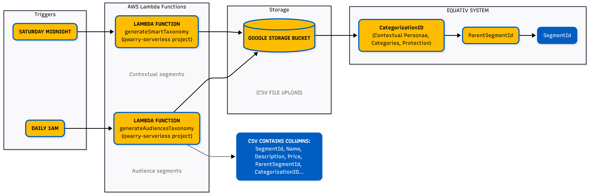
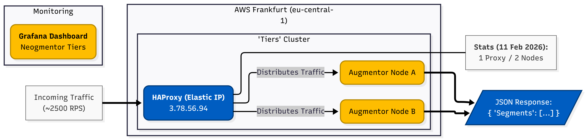
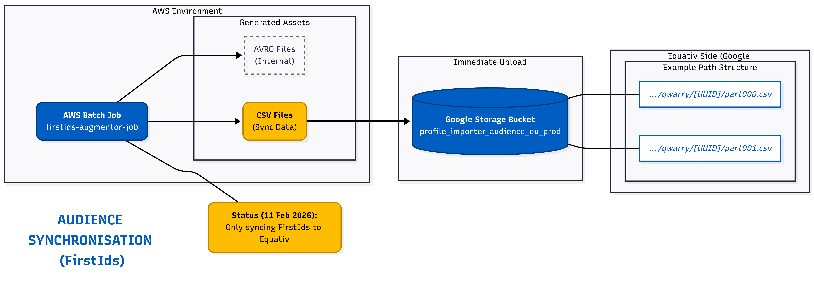
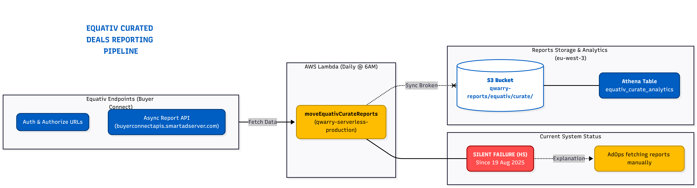

# Qwarry Equativ Integration

## Contextual Segments



Segments are created by uploading a CSV file to a Google Storage bucket.

The CSV file is generated through the Lambda function `generateSmartTaxonomy` from the `qwarry-serverless` project, triggered every **Saturday at midnight**.

The CSV contains the following columns:
`SegmentId`, `Name`, `Description`, `Price`, `ParentSegmentId`, `CategorizationID`, `IsSelectable`, `IsExclusion`, `IsActive`

The `CategorizationID` is based on categories created beforehand, including:
- Contextual Personae
- Contextual Categories
- Brand Protection

There is a hierarchy for segments on Equativ, structured as:
`CategorizationID` → `ParentSegmentId` → `SegmentId`

For example: **Contextual Categories → Automotive → SUV**

## Audience Segments

The CSV file is generated through the Lambda function `qwarry-serverless-production-generateAudiencesTaxonomy` from the `qwarry-serverless` project, triggered every **day at 1am**.

### Segments Hierarchy

There is a complex hierarchy coded on our side with pricing attribution. Some cleaning there may be useful.

<https://github.com/Qwarry/qwarry-serverless/blob/main/functions/generateTaxonomy/equativ/equativSegmentAttribute.js>

---

## Segments Data Synchronization



As of 11 Feb 2026, 1 proxy and 2 nodes, we reply at a rate of ~2500 RPS.

HAProxy stats: <http://3.78.56.94/haproxy?stats>

Grafana monitoring — "Neogmentor Tiers":
<https://g-d05d5b6d05.grafana-workspace.eu-central-1.amazonaws.com/d/cf4snfzbvs7i8e/neogmentor-tiers?orgId=1&var-Partner=equativ>

We send back for each URL an object `{ Segments: [...] }`.

We should not need to update the endpoint IP because we have allocated an Elastic IP. But if we need to change anything, we need to go by mail to **Audrey Ferrand** and **Athenaïs**.

---

## Audiences Synchronization



The AWS Batch job `firstids-augmentor-job` produces, along with AVRO files, CSV files that are immediately uploaded to Google Storage (Equativ side).

Example of uploaded files:
```
gs://profile_importer_audience_eu_prod/qwarry/87648f8c-fe2d-4a16-81eb-7321b5208d58/part000.csv
gs://profile_importer_audience_eu_prod/qwarry/87648f8c-fe2d-4a16-81eb-7321b5208d58/part001.csv
...
```

---

## Reporting Data



The reporting of the curated deals is done every morning at **6am** in the Lambda:
`qwarry-serverless-production-moveEquativCurateReports`

From specific Equativ endpoints:
```
authURL:      https://smartadserver.eu.auth0.com/oauth/token
authorizeURL: https://buyerconnectapis.smartadserver.com/authorize
apiUrl:       https://buyerconnectapis.smartadserver.com/async-report
baseURL:      https://buyerconnectapis.smartadserver.com
```

> ⚠️ The synchronization looks broken (HS) since **19 August 2025**.
> Naly told Amanda that AdOps were getting reports manually themselves — this explains the silent failure.

### Reports on Glue / Athena

**Table:** `equativ_curate_analytics`

- **Athena Console:** <https://eu-west-3.console.aws.amazon.com/athena/home?region=eu-west-3#/table-details/reports/equativ_curate_analytics>
- **S3 Location:** <https://s3.console.aws.amazon.com/s3/buckets/qwarry-reports?region=eu-west-3&prefix=equativ/curate/analytics/>
